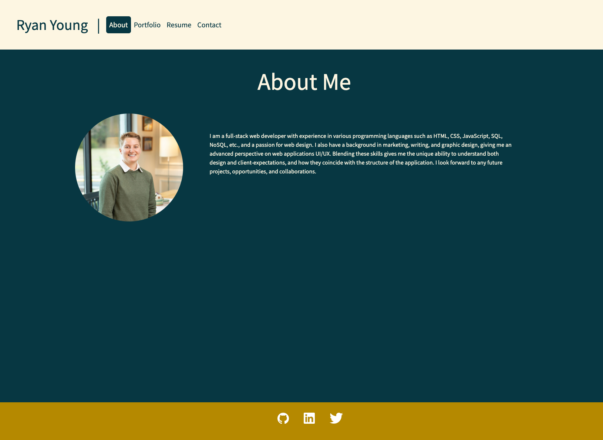

# React Portfolio

[Link to deployed site](https://ryan-young17.github.io/my-portfolio-react/)

## Table of Contents
- [Description](#Description)
- [Visuals](#Visuals)

## Description

This portfolio was created using React.js. It features an About page that tells a little bit about myself and my skills; a Resume page that previews my resume and gives the option to download; a Portfolio page featuring six completed projects with their corresponding links to deployed URL and the repositories; as well as a Contact page that features validation for each input. Click the link above to see my work!

## Visuals

